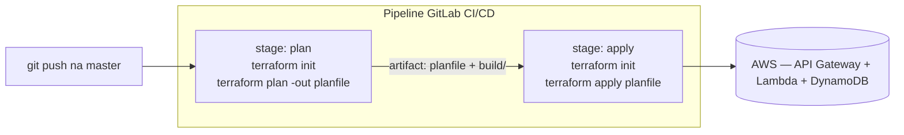

# 03.1 - Primeiro pipeline de CI/CD com GitLab

> **Segunda-feira, 10h.**
> Você é Platform Engineer na **Vortex Mobility**, a startup de micromobilidade que está escalando de 3 para 30 cidades. **Diego Tavares**, seu mentor SRE, te encontra no corredor:
>
> > *— "A gente já tem o runner de pé desde o mês passado. E o time de produto acabou de subir a primeira versão da **API de status da frota** — aquela que diz se cada scooter está disponível, em uso, carregando ou em manutenção. O código já está no `primeiro-projeto`. Só que ainda tem gente fazendo `terraform apply` do laptop pra subir isso. Quero que **todo push na master** rode `plan` e depois `apply` sozinho. O `plan` é a nossa parte de CI — mostra o que vai mudar. O `apply` é o CD — sobe a API de verdade. Consegue montar isso hoje?"*
>
> Você sabe que o GitLab faz isso com um único arquivo: o `.gitlab-ci.yml`. É hora de ver o primeiro pipeline da Vortex subir a API sozinho.

Os comandos de terminal deste lab rodam no **Codespaces** da disciplina. A configuração e a leitura dos pipelines acontecem no **console do GitLab** (gitlab.com).

> [!WARNING]
> **Pré-requisitos obrigatórios antes de começar:**
>
> - [ ] **Módulo 02 concluído** — GitLab Runner registrado com as tags `shell` e `terraform`, e repositório `primeiro-projeto` já existente na sua conta do GitLab.
> - [ ] **Chave SSH do GitLab** configurada no Codespaces em `/home/vscode/.ssh/gitlab`.
> - [ ] **Credenciais AWS do Academy atualizadas** no Codespaces.
> - [ ] O `primeiro-projeto` já tem o código Terraform da API serverless (com `state.tf` apontando para um bucket S3 seu).
>
> **Valide rapidamente:**
>
> ```bash
> aws sts get-caller-identity
> ```
>
> Se retornar o JSON com seu `Account` e `Arn`, e o runner aparecer **online** em **Settings → CI/CD → Runners** no GitLab, você está pronto.

Neste laboratório vamos criar o primeiro pipeline de CI/CD da Vortex usando GitLab. Vamos escrever um `.gitlab-ci.yml` com dois stages — `plan` (Continuous Integration) e `apply` (Continuous Delivery) — e ver o GitLab Runner executá-los automaticamente a cada `push` na `master`. O resultado do `apply` é uma **API HTTP funcionando**: API Gateway na frente, uma função Lambda processando, e uma tabela DynamoDB guardando o status das scooters. O ponto-chave técnico é entender como o `planfile` gerado no `plan` é passado adiante como **artefato** para o `apply`.

## Principais pontos de aprendizagem

- entender a anatomia de um `.gitlab-ci.yml` (stages, jobs, script, tags, artifacts)
- separar CI (`plan`) de CD (`apply`) num pipeline de infraestrutura
- passar um `planfile` (e o artefato de build da Lambda) entre stages usando **artifacts**
- direcionar jobs para o runner certo com **tags**
- disparar o pipeline com um `git push` e ler os logs no GitLab
- ver uma API serverless (API Gateway + Lambda + DynamoDB) subir sem `apply` manual

## O que você terá ao final

Um pipeline de 2 stages que roda sozinho a cada push, provisiona a **API de status da frota** do `primeiro-projeto` e mostra o `plan` antes do `apply`. **Diego vai querer ver o pipeline verde no GitLab e a API respondendo a um `curl` sem ninguém ter rodado `apply` na mão** — esse é o entregável simbólico do lab.

> [!TIP]
> Sempre que encontrar um bloco com o título **💡 Clique para entender**, abra esse trecho. Ele traz a anatomia do comando, o contexto da aula e links oficiais para aprofundamento.

## Mapa do lab

| Parte | O que você faz | Passos | Tempo |
|-------|----------------|--------|-------|
| [Parte 1](#parte-1---conhecendo-a-api-da-vortex) | Conhecendo a API e preparando o projeto | [1](#passo-1) · [2](#passo-2) · [3](#passo-3) | ~8 min |
| [Parte 2](#parte-2---escrevendo-o-pipeline) | Escrevendo o `.gitlab-ci.yml` | [4](#passo-4) · [5](#passo-5) | ~10 min |
| [Parte 3](#parte-3---disparando-o-pipeline) | Disparando o pipeline | [6](#passo-6) · [7](#passo-7) | ~5 min |
| [Parte 4](#parte-4---lendo-os-resultados) | Lendo os resultados e testando a API | [8](#passo-8) · [9](#passo-9) · [10](#passo-10) · [11](#passo-11) | ~12 min |

> [!TIP]
> Se travou em algum passo, clique no número do passo na coluna **Passos** acima.

<details>
<summary><b>💡 O que é um pipeline de CI/CD em uma frase</b></summary>
<blockquote>

CI/CD é a prática de **automatizar o caminho do código até o ambiente**. No GitLab, esse caminho é descrito em um único arquivo na raiz do repositório: o `.gitlab-ci.yml`.

- **CI (Continuous Integration)**: a cada mudança, o GitLab valida/testa o código de forma automática. Aqui, isso é o `terraform plan` — ele mostra o que mudaria, sem aplicar.
- **CD (Continuous Delivery/Deployment)**: depois que a validação passa, o GitLab aplica a mudança no ambiente. Aqui, isso é o `terraform apply`, que sobe a API.

O pipeline é executado por um **runner** — um servidor que o GitLab aciona para rodar os comandos. No módulo 02 você registrou um runner próprio com as tags `shell` e `terraform`; é ele quem vai pegar os jobs deste lab.

Documentação oficial:
- [GitLab CI/CD — visão geral](https://docs.gitlab.com/ee/ci/)
- [Estrutura do `.gitlab-ci.yml`](https://docs.gitlab.com/ee/ci/yaml/)

</blockquote>
</details>

## Contexto

Antes de escrever uma linha de YAML, vale entender por que esse pipeline existe.

| Aspecto | Resposta curta |
|---------|----------------|
| **Problema de negócio** | Na Vortex, o deploy da API era feito com `apply` do laptop, sem revisão — mudanças chegavam à nuvem sem ninguém ver o `plan`. |
| **Pergunta que ele responde bem** | "O que vai mudar na infra antes de aplicar, e como subo a API de forma rastreável a cada push?" |
| **Pergunta que ele responde mal** | "Como faço rollback automático se o `apply` quebrar em produção?" (precisa de mais maturidade — fora do escopo deste lab). |
| **Quando acontece na vida real** | Toda equipe de plataforma que sai do "click-ops" e quer infra versionada e auditável passa por esse primeiro pipeline. |

O fluxo que vamos construir tem dois stages encadeados — o `plan` gera um arquivo de plano que o `apply` consome:



---

## Parte 1 - Conhecendo a API da Vortex

### Resultado esperado desta parte

Ao final desta etapa, você terá entendido o que o código do `primeiro-projeto` provisiona e estará dentro da pasta com o `state.tf` apontando para o seu bucket de estado remoto.

---

<a id="passo-1"></a>

**1.** No terminal do Codespaces, entre na pasta do repositório `primeiro-projeto` (o mesmo que você criou no módulo 02):

```bash
cd /workspaces/FIAP-Platform-Engineering/02-Ansible/01-provisionando-gitlab-runner/primeiro-projeto
```

<details>
<summary><b>💡 Clique para entender: o que vive no primeiro-projeto agora</b></summary>
<blockquote>

Este lab continua de onde o módulo 02 parou: o `primeiro-projeto` já existe no GitLab, já tem o runner registrado e agora traz o código da **API de status da frota** da Vortex. Os arquivos Terraform são:

- **`main.tf`** — provider AWS e a referência ao `LabRole` (execution role da Lambda).
- **`dynamodb.tf`** — a tabela `vortex-frota-scooters` (modo on-demand, free-tier).
- **`lambda.tf`** — empacota o código Python da pasta `src/` num zip (via `archive_file`) e cria a função Lambda.
- **`apigw.tf`** — a API Gateway HTTP com três rotas (`GET /scooters`, `GET /scooters/{id}`, `PUT /scooters/{id}`).
- **`src/handler.py`** — o código da Lambda: lê e grava o status das scooters no DynamoDB.
- **`outputs.tf`** — devolve a URL da API ao final do `apply`.

Nosso trabalho aqui é só **adicionar o pipeline** (o `.gitlab-ci.yml`) a esse projeto. O runner que você configurou com Ansible é o mesmo que vai executá-lo.

</blockquote>
</details>

---

<a id="passo-2"></a>

**2.** Dê uma olhada no código da Lambda, para saber o que a API faz:

```bash
code src/handler.py
```

A API expõe três rotas: listar todas as scooters (`GET /scooters`), consultar uma (`GET /scooters/{id}`) e registrar/atualizar o status de uma (`PUT /scooters/{id}`). Os status válidos são `available`, `in_use`, `maintenance` e `charging`.

---

<a id="passo-3"></a>

**3.** Confirme que o `state.tf` aponta para o **seu** bucket de estado remoto. Abra o arquivo:

```bash
code state.tf
```

Verifique que o nome do bucket é o mesmo que você usou para guardar o estado nas demos anteriores (algo como `base-config-<SEU-RM>`). Se estiver diferente, ajuste e salve.

> [!IMPORTANT]
> O `terraform apply` no pipeline vai usar esse estado remoto. Se o bucket estiver errado, o pipeline vai falhar no `init`. Confira **agora** — falhar cedo aqui custa 30 segundos; descobrir depois custa um pipeline vermelho.

### Checkpoint

Se você chegou até aqui, então:

- você está na pasta do `primeiro-projeto` no Codespaces
- entendeu que o código provisiona uma API serverless (API Gateway + Lambda + DynamoDB)
- o `state.tf` aponta para o seu bucket S3 de estado remoto

---

## Parte 2 - Escrevendo o pipeline

### Resultado esperado desta parte

Ao final desta etapa, o arquivo `.gitlab-ci.yml` estará criado na raiz do `primeiro-projeto` com os stages `plan` e `apply`.

---

<a id="passo-4"></a>

**4.** Crie o arquivo `.gitlab-ci.yml`, que terá as instruções do que o pipeline deve fazer:

```bash
code .gitlab-ci.yml
```

---

<a id="passo-5"></a>

**5.** Inclua o conteúdo abaixo no `.gitlab-ci.yml`. Com esses comandos, o pipeline terá 2 stages: `plan` e `apply`. O `plan` é a parte de CI; o `apply`, a de CD. Note que o `planfile` **e a pasta `build/`** (onde o Terraform empacota o zip da Lambda) são exportados como **artefato** no `plan` para serem consumidos pelo `apply`:

```yaml
---
stages:
  - plan
  - apply

plan:
  stage: plan
  script:
    - terraform init
    - terraform plan -out "planfile"
  artifacts:
    paths:
      - planfile
      - build/
  tags:
    - shell

apply:
  stage: apply
  script:
    - terraform init
    - terraform apply planfile
  dependencies:
    - plan
  tags:
    - shell
```

<details>
<summary><b>💡 Clique para entender: anatomia do .gitlab-ci.yml</b></summary>
<blockquote>

Leia o arquivo de cima para baixo:

- **`stages`**: a ordem das fases do pipeline. O GitLab só começa o `apply` depois que o `plan` termina com sucesso. Stages rodam em sequência; jobs do mesmo stage rodariam em paralelo.
- **`plan` / `apply`**: cada um é um **job**. O `stage:` diz a qual fase o job pertence.
- **`script`**: a lista de comandos shell que o runner executa, na ordem. Aqui rodamos `terraform init` (baixa providers e configura o backend) e depois o comando principal.
- **`terraform plan -out "planfile"`**: em vez de só mostrar o plano na tela, salvamos o plano em disco (`planfile`). Isso garante que o `apply` aplique **exatamente** o que foi planejado, sem recalcular.
- **`artifacts: paths: [planfile, build/]`**: marca o `planfile` **e a pasta `build/`** como arquivos que devem sobreviver ao fim do job e ser disponibilizados para os próximos stages. A pasta `build/` contém o `lambda.zip` que o Terraform gerou no `plan` — sem ela, o `apply` não acharia o pacote da Lambda.
- **`dependencies: [plan]`** no `apply`: declara que o `apply` precisa dos artefatos do job `plan` — é assim que o `planfile` e o `build/` "viajam" de um stage para o outro.
- **`tags: [shell]`**: roteia o job para um runner que tenha a tag `shell`. É o runner que você registrou no módulo 02.

### Por que separar plan de apply?

Porque o `plan` é seguro (não muda nada) e o `apply` é destrutivo/criador. Separar deixa o `plan` visível como um "preview" auditável antes de qualquer mudança real chegar à AWS — exatamente o que o Diego pediu.

Documentação oficial:
- [Jobs e artifacts no GitLab CI](https://docs.gitlab.com/ee/ci/jobs/)
- [`terraform plan -out`](https://developer.hashicorp.com/terraform/cli/commands/plan#out-filename)

</blockquote>
</details>

<details>
<summary><b>⚠ Se der erro: <code>This job is stuck because you don't have any active runners</code></b></summary>
<blockquote>

O job ficou "pending" e não começou. Quase sempre é problema de **tag** ou de **runner offline**:

- Confirme que o runner está **online** em **Settings → CI/CD → Runners** no GitLab.
- A tag no `.gitlab-ci.yml` (`shell`) precisa ser **exatamente igual** a uma tag do runner. No módulo 02 o runner foi criado com as tags `shell` e `terraform`, então `tags: [shell]` casa.
- Se o runner está sem tags e o GitLab não roda jobs com tag: marque a opção **"Run untagged jobs"** nas configurações do runner.

</blockquote>
</details>

### Checkpoint

Se você chegou até aqui, então:

- o `.gitlab-ci.yml` existe na raiz do `primeiro-projeto`
- ele tem dois stages (`plan` e `apply`) e ambos os jobs usam a tag `shell`

---

## Parte 3 - Disparando o pipeline

### Resultado esperado desta parte

Ao final desta etapa, o `push` na `master` terá disparado o pipeline no GitLab.

---

<a id="passo-6"></a>

**6.** Atualize o repositório do GitLab com os comandos abaixo. O `push` na `master` é o gatilho que dispara o pipeline:

```bash
git add .gitlab-ci.yml
git add state.tf
git commit -m "primeiro pipeline"
eval $(ssh-agent -s)
ssh-add -k /home/vscode/.ssh/gitlab
git push origin master
```

<details>
<summary><b>💡 Clique para entender: por que o ssh-agent antes do push</b></summary>
<blockquote>

O `primeiro-projeto` foi clonado via SSH. Os dois comandos `ssh-agent` / `ssh-add` carregam a chave privada do GitLab (`/home/vscode/.ssh/gitlab`, criada no módulo 02) na sessão atual do terminal. Sem isso, o `git push` falha com `Permission denied (publickey)`.

Você precisa rodar esses dois comandos toda vez que abre um terminal novo no Codespaces, porque o agente SSH não persiste entre sessões.

</blockquote>
</details>

<details>
<summary><b>⚠ Se der erro: <code>git@gitlab.com: Permission denied (publickey)</code></b></summary>
<blockquote>

A chave SSH não está carregada na sessão atual. Rode novamente:

```bash
eval $(ssh-agent -s)
ssh-add -k /home/vscode/.ssh/gitlab
```

Se ainda falhar, confirme que a chave pública (`/home/vscode/.ssh/gitlab.pub`) está cadastrada em **User Settings → SSH Keys** no GitLab.

</blockquote>
</details>

---

<a id="passo-7"></a>

**7.** No GitLab, abra seu projeto `primeiro-projeto` e, na lateral esquerda, clique em **Build** e depois em **Pipelines**.


### Checkpoint

Se você chegou até aqui, então:

- o `push` foi aceito sem erro de autenticação
- um pipeline novo aparece na lista de **Pipelines** do projeto

---

## Parte 4 - Lendo os resultados

### Resultado esperado desta parte

Ao final desta etapa, o pipeline terá rodado por completo (verde), a API estará no ar e você terá testado uma das rotas com `curl`.

---

<a id="passo-8"></a>

**8.** Você verá o pipeline rodando, como na imagem abaixo:


---

<a id="passo-9"></a>

**9.** Clique no **id da execução** do pipeline para acessar todas as etapas e ler os logs de cada uma:


Explore os logs de cada stage. Repare que o log do `plan` mostra o preview das mudanças (`9 to add`) e o do `apply` mostra os recursos sendo efetivamente criados — terminando com a saída `api_base_url`.

---

<a id="passo-10"></a>

**10.** Copie a **URL da API** que apareceu no final do log do stage `apply` (a saída `api_base_url`, algo como `https://xxxxxx.execute-api.us-east-1.amazonaws.com/`).

<!-- PRINT SUGERIDO: img/apigw-url-no-log.png
     Final do log do stage apply no GitLab, destacando a linha de Outputs com
     api_base_url = "https://....execute-api.us-east-1.amazonaws.com/". Enquadrar
     so essa secao de Outputs do terraform apply. -->


---

<a id="passo-11"></a>

**11.** No **terminal do Codespaces**, teste a API que o pipeline acabou de subir. Troque `<URL_DA_API>` pela URL que você copiou:

```bash
# Registra o status de uma scooter (PUT)
curl -X PUT "<URL_DA_API>/scooters/VORTEX-SP-001" \
  -H 'Content-Type: application/json' \
  -d '{"status":"in_use"}'

# Lista todas as scooters (GET)
curl "<URL_DA_API>/scooters"
```

Você deve ver respostas em JSON: primeiro `{"updated": {...}}` e depois a lista com a scooter que você acabou de registrar. **A API que o pipeline subiu está no ar, sem ninguém ter rodado `apply` na mão.**

<!-- PRINT SUGERIDO: img/curl-api-respondendo.png
     Terminal do Codespaces mostrando o resultado dos dois curl: o PUT retornando
     {"updated": ...} e o GET retornando a lista com a scooter. Enquadrar os dois
     comandos e suas respostas JSON. -->


<details>
<summary><b>⚠ Se der erro: o <code>apply</code> falha no <code>init</code> com erro de backend S3</b></summary>
<blockquote>

Quase sempre é o `state.tf` apontando para um bucket inexistente ou credenciais AWS expiradas no runner:

- Confirme no passo 3 que o bucket do `state.tf` é o seu (`base-config-<SEU-RM>`) e que ele existe no S3.
- O runner roda no EC2 que você provisionou no módulo 02. Se ele usa credenciais do Academy, elas podem ter expirado — renove e registre o runner novamente, se necessário.

</blockquote>
</details>

<details>
<summary><b>⚠ Se der erro: o <code>apply</code> falha sem achar o pacote da Lambda (<code>build/lambda.zip</code>)</b></summary>
<blockquote>

O artefato `build/` não viajou do `plan` para o `apply`. Confirme que o bloco `artifacts: paths:` do job `plan` inclui **as duas** entradas: `planfile` **e** `build/` (passo 5). Sem o `build/`, o `apply` não encontra o pacote da Lambda que o `plan` gerou.

</blockquote>
</details>

### Checkpoint

Se você chegou até aqui, então:

- o pipeline terminou verde (stages `plan` e `apply` com sucesso)
- a saída `api_base_url` apareceu no log do `apply`
- o `curl` na API retornou JSON — a API está no ar

---

## Conclusão

Neste laboratório você:

- criou seu primeiro `.gitlab-ci.yml` com os stages `plan` (CI) e `apply` (CD)
- passou o `planfile` e o pacote da Lambda entre stages usando **artifacts** + `dependencies`
- roteou os jobs para o runner próprio com `tags: shell`
- disparou o pipeline com um `git push` e leu os logs no GitLab
- provisionou uma API serverless (API Gateway + Lambda + DynamoDB) automaticamente, sem `apply` manual

**Mensagem para Diego**: ninguém mais precisa rodar `apply` do laptop. Todo push na master mostra o `plan` e sobe a API em seguida, com log auditável. Falta só uma coisa que ele pediu — o **gate de segurança e qualidade** antes do `apply`.

---

## Próximo passo

Abra o próximo lab: **[Lab 03.2 — Validando e gerando relatórios](../02-Validando-e-gerando-relatorios/README.md)**.

Lá adicionamos um stage `validate` com `terraform fmt`/`validate`, **TFLint**, **Checkov** e **terraform test** — o gate que barra configuração malfeita ou insegura **antes** do `apply`, exatamente o que faltava no pedido do Diego.

---

<details>
<summary><b>💡 Glossário rápido — termos que aparecem neste lab</b></summary>
<blockquote>

| Termo | O que é |
|-------|---------|
| **CI (Continuous Integration)** | Validar/testar o código automaticamente a cada mudança. Aqui é o `terraform plan`. |
| **CD (Continuous Delivery/Deployment)** | Entregar/aplicar a mudança no ambiente após a validação. Aqui é o `terraform apply`, que sobe a API. |
| **`.gitlab-ci.yml`** | Arquivo na raiz do repositório que descreve o pipeline (stages, jobs, scripts). |
| **Stage** | Fase do pipeline. Stages rodam em sequência; jobs do mesmo stage, em paralelo. |
| **Job** | Unidade de execução dentro de um stage (ex: `plan`, `apply`). |
| **Runner** | Servidor que o GitLab aciona para executar os jobs. Aqui é o runner self-hosted do módulo 02. |
| **Tag** | Rótulo que casa um job com um runner. `tags: [shell]` envia o job ao runner com a tag `shell`. |
| **Artifact** | Arquivo que sobrevive ao fim de um job e é passado adiante. Aqui são o `planfile` e a pasta `build/`. |
| **`planfile`** | Plano de execução salvo em disco por `terraform plan -out`. Garante que o `apply` aplique exatamente o planejado. |
| **API Gateway / Lambda / DynamoDB** | A stack serverless que o pipeline sobe: a porta HTTP, o código que processa e o banco que guarda o status das scooters. |

</blockquote>
</details>

<details>
<summary><b>💡 Como pedir ajuda se travou</b></summary>
<blockquote>

Antes de abrir issue, colete estas 4 informações — elas reduzem o tempo de resposta em 10×:

1. **Em que passo você está** (ex: "passo 6, no `git push`")
2. **Mensagem de erro literal** (copie o texto do log do GitLab ou do terminal — texto, não screenshot)
3. **Status do runner** (online/offline em **Settings → CI/CD → Runners**) e as tags dele
4. **O que você já tentou**

Canais (em ordem de prioridade):

- **Issues do repositório**: [github.com/vamperst/FIAP-Platform-Engineering/issues](https://github.com/vamperst/FIAP-Platform-Engineering/issues)
- **E-mail do professor**: `Rafael@rfbarbosa.com`
- **LinkedIn**: [rafael-barbosa-serverless](https://www.linkedin.com/in/rafael-barbosa-serverless/)
- **Antes de tudo**: ~80% dos jobs "stuck" são tag errada ou runner offline. Confira isso primeiro.

</blockquote>
</details>
